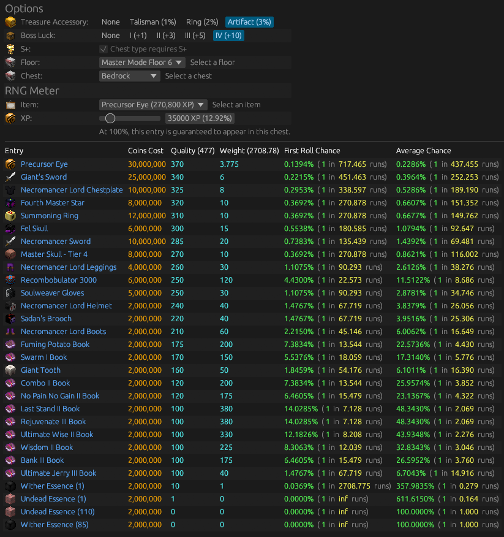

# Catacombs Loot Calculator
An on-the-fly calculator for loot obtained in the [Catacombs](https://wiki.hypixel.net/Catacombs) in [Hypixel SkyBlock](https://wiki.hypixel.net/Main_Page), built in [Rust](https://www.rust-lang.org) using [eframe](https://github.com/emilk/egui/tree/master/crates/eframe) and [egui](https://github.com/emilk/egui/).

## Usage
First, visit https://calc.pigicial.com, then   choose the [floor](https://wiki.hypixel.net/Catacombs#Floors) (regular or [Master Mode](https://wiki.hypixel.net/Catacombs#Master_Mode)) and [chest](https://wiki.hypixel.net/Catacombs#Rewards).

You'll then have multiple options to choose from, all of which have an impact on drop rates:
- [Accessory](https://wiki.hypixel.net/Accessory) Bonus: None, [Treasure Talisman](https://wiki.hypixel.net/Treasure_Talisman), [Ring](https://wiki.hypixel.net/Treasure_Ring), or [Artifact](https://wiki.hypixel.net/Treasure_Artifact)
- [Boss Luck](https://wiki.hypixel.net/Essence#Essence_Shop) Bonus: None, +1, +3, +5, +10
- Whether the runs are S+ (300+ Score)
- RNG Meter Options:
  - The selected item, based on the selected floor
  - How much XP has been attributed to that item

## Example
This is an example using the [Catacombs Floor VI](https://wiki.hypixel.net/Catacombs_Floor_VI) Bedrock Chest as the loot table.

